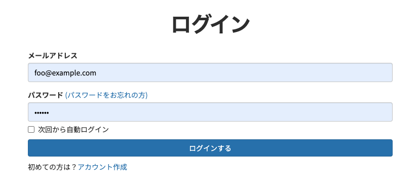
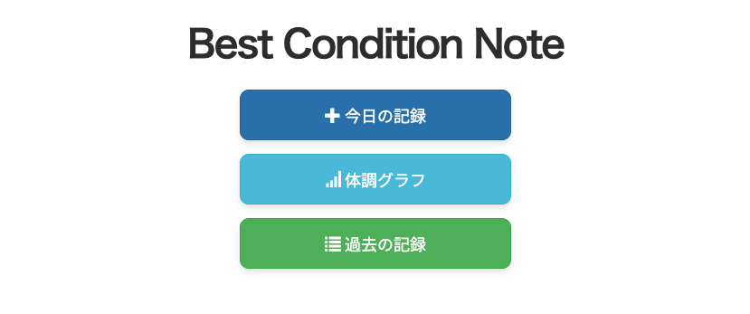
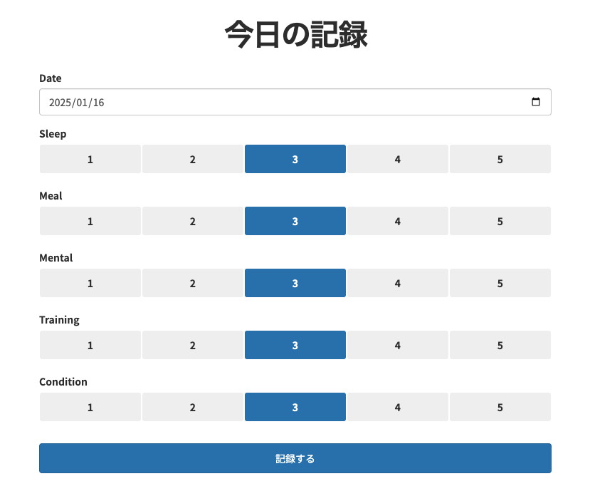
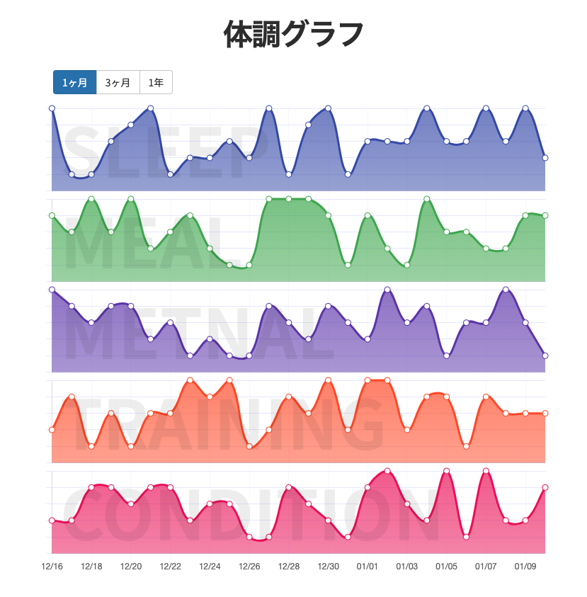
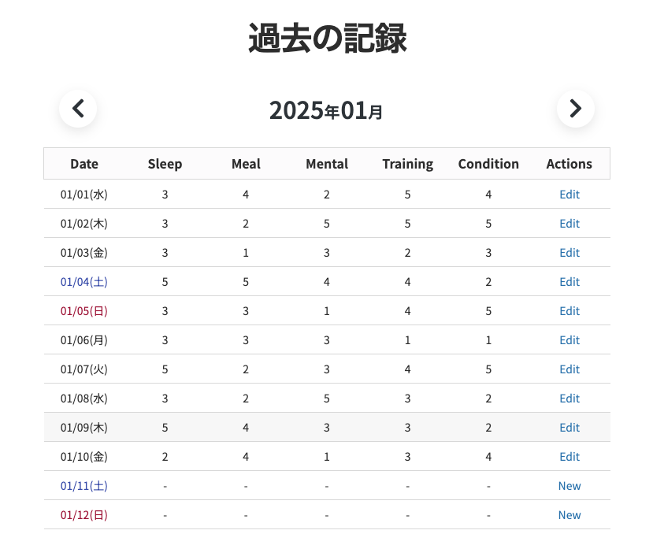
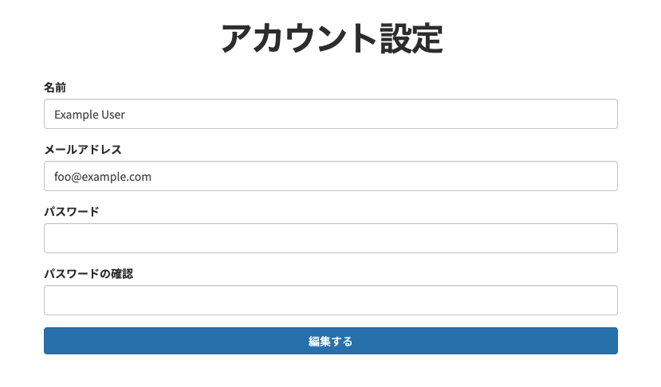

# Best Condition Note

## プロダクト概要
### サービスの目的
食事、睡眠、運動など体調の記録と閲覧、分析
### ターゲットユーザー
積極的に体調管理などをしている意識が高い人向け

## アプリケーションのURL
https://best-condition-note.com

## 技術スタック
- Ruby on Rails 7
- Bootstrap 3
- PostgreSQL
- Minitest
- 実行環境: Render
- メールサーバー：Mailgun

## 主な機能
- ユーザー認証
- データの記録、編集、削除
- グラフによる閲覧(chart.js)

## 今後の開発予定
- 自由記述欄の追加
- プッシュ通知
- AIによる分析、洞察を与える
- 分析用のグラフの追加（曜日別、月別、など）

## テストユーザー
- メールアドレス: foo@example.com
- パスワード: foobar

## サイトイメージ

